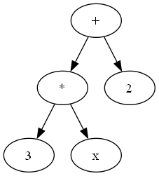

# pyCAS
Mini Computer Algebra System using Python

## Features

- Mathematical expression parsing
- Expression tree visualization
- Variable substitution
- And soon(TM) more

## Examples

Create an Expression 

```python3
e = Expression.fromstr('3x+2')
print(e) # + ( * ( 3, x ), 2 )
```

Visualize the expression tree

```python3
from cas import graphing

graph = graphing.fromExpr(e)
graphing.view(graph)
```



Substitute the variable in an expression

```python3
f = subs(e, 'x', 5)
print(f) # + ( * ( 3, 5 ), 2 )
```

## Tests

Run all tests:

```bash
pyCas $ python -m unittest discover
```

Run tests from a specific file:

```bash
pyCas $ python -m unittest ./tests/filename.py
```